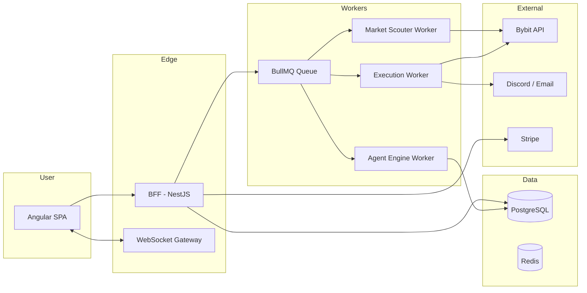
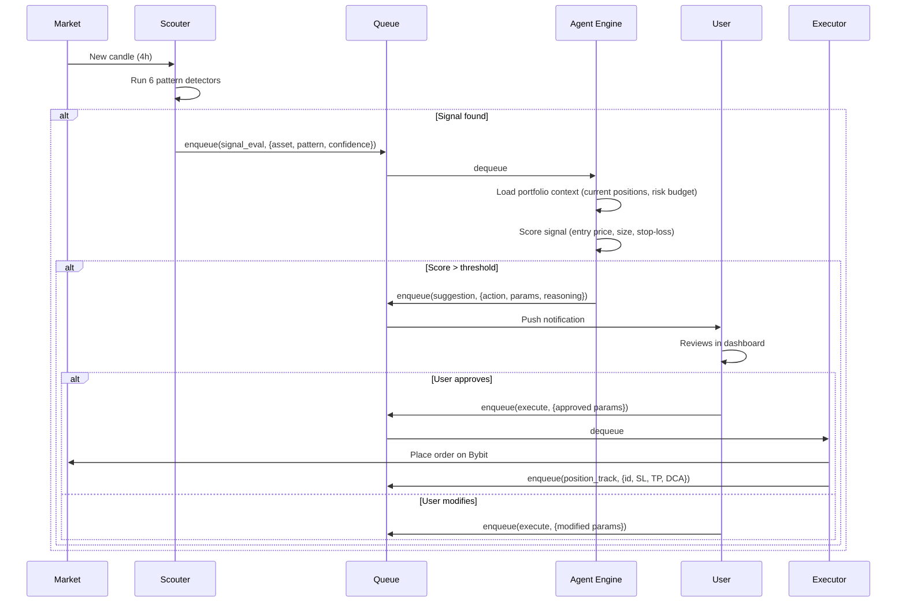
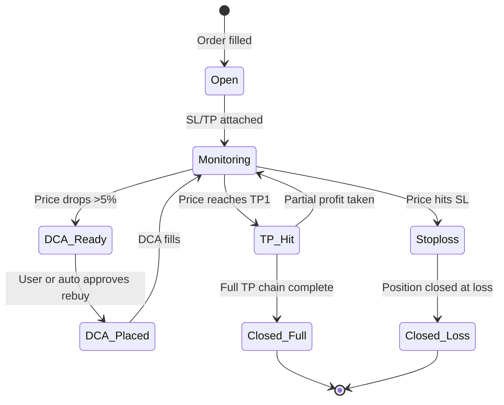
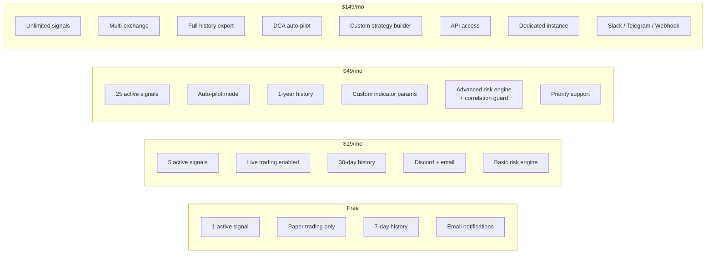

# Portfolio — Smart Trading Agent

> **AI-native portfolio manager that thinks, acts, and adapts alongside you.**

---

## 1. Vision

Most traders drown in noise. Multiple exchanges, dozens of positions, endless charts, conflicting signals. **Portfolio** is your autonomous co-pilot: it watches your back, suggests moves before you ask, and executes when you're ready. Not a signal shop. Not a copy-trade platform. An **intelligent agent** that understands your strategy, risk tolerance, and portfolio context — then acts on it.

**Long-term vision:** An open marketplace where anyone can deploy, share, or sell trading agents built on the Portfolio runtime.

---

## 2. What It Does (Core Loop)

```
  Market Data ──► Scouter ──► Signals ──► Agent Engine ──► Suggestions ──► You Decide ──► Execution
                      ▲                                                        │
                      └──────────────── Feedback Loop ◄─────────────────────────┘
```

**Scouter** — scans 50+ assets across multiple timeframes, detects patterns (breakouts, reversals, mean-reversion) and emits structured signals.

**Agent Engine** — evaluates signals against your portfolio context (current positions, risk budget, strategy rules). Decides what matters *right now*.

**You stay in control** — every suggestion requires approval (configurable auto-pilot mode for power users).

**Execution** — one-click or auto. Positions are managed with trailing stops, DCA rebuys, take-profit ladders.

---

## 3. MVP Scope — v1.0

| Area | What Ships | What Waits |
|------|-----------|------------|
| **Onboarding** | Connect Bybit API key (read + trade permissions) | Multi-exchange (Binance, OKX, Coinbase) |
| **Portfolio Dashboard** | Real-time P&L, position map, risk exposure per asset/sector | Multi-currency, tax lot accounting |
| **Scouter Signals** | 6 core patterns: breakout, pullback, RSI divergence, volume spike, SMA cross, ATR breakout | Custom indicators, ML signals |
| **Agent Suggestions** | Entry/exit alerts with reasoning ("Enter 0.5 BTC — breakout above $60k with 2.5x volume") | Auto-execution tier |
| **Position Management** | Trailing stop-loss, DCA rebuys, take-profit ladders | Options/derivatives |
| **Risk Engine** | Max drawdown limit, position size % cap, daily loss limit, correlation guard | Portfolio margin, VaR |
| **User Accounts** | Email + Google OAuth, Stripe billing | SSO, team accounts |
| **Analytics** | Win rate, Sharpe ratio, max drawdown, avg hold time | Attribution analysis |
| **Notifications** | Discord webhook, email | Slack, Telegram, SMS |
| **Infrastructure** | Single-tenant dedicated instances | Multi-tenant with isolated queues |

### MVP User Flow

```mermaid
flowchart TD
    A[User signs up] --> B[Connects Bybit API key]
    B --> C[Onboarding wizard:<br/>risk profile, strategy preferences]
    C --> D[Scouter begins scanning<br/>on market schedule (4h)]
    D --> E{Signal detected?}
    E -->|No| D
    E -->|Yes| F[Agent evaluates against<br/>portfolio context]
    F --> G{Suggestion generated}
    G --> H[Push notification / email<br/>"Consider buying 0.3 SOL"]
    H --> I[User reviews in dashboard]
    I --> J{User approves?}
    J -->|Modify & execute| K[Tweak params, place order]
    J -->|Auto-pilot user| L[Agent places order directly]
    J -->|Ignore| D
    K --> M[Position tracked with<br/>SL / TP / DCA rules]
    L --> M
    M --> D
```

---

## 4. Architecture Overview



### Key Decisions

| Decision | Choice | Rationale |
|----------|--------|-----------|
| Queue | **BullMQ** (Redis) | Already in stack; cron + event + manual triggers through same pipe |
| Scouter schedule | **4h cadence** | Balances freshness with API rate limits; configurable per asset |
| Data store | **PostgreSQL** | Reliable, good JSON support for signal/position blobs |
| Auth | **Clerk** (or Auth0) | Social login, MFA, webhooks out of the box |
| Payments | **Stripe** | Recurring subscriptions, usage metering, customer portal |
| Deployment | **Railway / Fly.io** | Simple Docker deploys, per-user isolated instances |

---

## 5. Smart Trading Agent — Deep Dive

### 5.1 Signal Lifecycle



### 5.2 Risk Engine — Decision Flow

```mermaid
flowchart TD
    SIGNAL[Incoming Signal<br/>BTC Long, size 1.0] --> R1{Portfolio exposure<br/>> 60%?}
    R1 -->|Yes| REJECT[Reject — max drawdown guard]
    R1 -->|No| R2{Position size > 15%<br/>of portfolio?}
    R2 -->|Yes| REJECT
    R2 -->|No| R3{Daily loss limit<br/>reached?}
    R3 -->|Yes| REJECT
    R3 -->|No| R4{Correlation with<br/>existing positions?}
    R4 -->|High (>0.7)| REJECT[Reject — correlation guard]
    R4 -->|Low| APPROVE[Approve — generate suggestion]
    APPROVE --> SUGGEST[Push to user queue]
```

### 5.3 Position Management Lifecycle



---

## 6. Pricing Model

### Tier Structure



### Pricing Strategy

| Tier | Price | Target User | Hook |
|------|-------|-------------|------|
| **Free** | $0 | Anyone curious | See the value before paying |
| **Starter** | $19/mo ($190/yr) | Retail trader, 1-2 accounts | Covers the subscription cost with one good trade |
| **Pro** | $49/mo ($490/yr) | Active trader, 3-5 accounts | Auto-pilot is the unlock |
| **Elite** | $149/mo ($1,490/yr) | Power trader / small fund | Dedicated infra, unlimited everything |

**Annual discount:** 2 months free when paid yearly.

**Free trial:** 14-day Pro trial on signup (no credit card for first 7 days).

### Future Monetization — Agent Marketplace

Once the `IStrategy` plugin interface is hardened (see `micro.md`), third-party developers can publish agents:

- **Agent Listing:** Developer publishes a strategy (e.g., "Momentum Scalper v2")
- **Revenue Split:** 70/30 in favor of developer
- **Pricing Models:** One-time purchase, monthly subscription, or performance-based (20% of profit)
- **Certification:** Portfolio certifies agents that pass 90-day paper trading validation

---

## 7. Development Phases

### Phase 1 — Foundation (Weeks 1-4)
- [ ] Fix monorepo workspace build (contracts package resolution)
- [ ] Harden `IStrategy` plugin interface in `packages/contracts`
- [ ] Extract scouter signal types into contracts
- [ ] Set up database schema (users, api_keys, positions, signals, suggestions)
- [ ] Deploy BullMQ queues with Redis
- [ ] Implement user auth + onboarding flow

### Phase 2 — MVP Core (Weeks 5-8)
- [ ] Dashboard UI: portfolio overview, position table, P&L charts
- [ ] Scouter: 6 core pattern detectors running on schedule
- [ ] Agent Engine: signal scoring + suggestion generation
- [ ] Execution: one-click trade placement on Bybit
- [ ] Position management: trailing SL, TP ladder, DCA rebuys
- [ ] Notification system: Discord + email

### Phase 3 — Risk & Trust (Weeks 9-10)
- [ ] Risk engine: drawdown, size caps, daily loss, correlation guard
- [ ] Paper trading mode (simulated execution)
- [ ] Analytics: performance metrics dashboard
- [ ] Audit log: every signal, suggestion, and trade recorded

### Phase 4 — Scale & Growth (Weeks 11-14)
- [ ] Stripe billing integration + customer portal
- [ ] Multi-tier subscription enforcement
- [ ] Waitlist → public launch
- [ ] Landing page + docs site
- [ ] Feedback loop: user ratings on suggestions

### Phase 5 — Marketplace (Q3-Q4)
- [ ] `IStrategy` plugin registry
- [ ] Agent upload, versioning, paper-trading validation
- [ ] Leaderboard (verified paper-trading performance)
- [ ] Developer revenue dashboard
- [ ] Community reviews & ratings

---

## 8. Competitive Landscape

| Product | Type | Portfolio's Advantage |
|---------|------|----------------------|
| **TradingView** | Charting + alerts | We execute, not just alert |
| **3Commas** | DCA bots | We explain *why*, not just *what* |
| **Cryptohopper** | Auto-trading | Risk-aware context engine |
| **CoinLedger** | Tax reporting | We manage live positions, not just report |
| **ChatGPT / Claude** | Generic LLM | We have real-time market + portfolio context |

Portfolio's moat is the **agent engine**: it understands *your* portfolio, *your* risk tolerance, and explains suggestions in plain English. It's not a bot — it's a teammate.

---

## 9. Metrics That Matter

| Metric | Target (Month 6) |
|--------|------------------|
| **Active users** | 500 |
| **Paying users** | 100 (20% conversion) |
| **MRR** | $5,000+ |
| **Suggestion acceptance rate** | >60% |
| **Avg. portfolio outperformance** | +2% vs buy-and-hold |
| **Churn** | <5% monthly |

---

## 10. Risk & Mitigation

| Risk | Mitigation |
|------|-----------|
| Bybit API rate limits | Scouter schedule + batching; cache kline data |
| Users lose money and blame the tool | Clear disclaimers, paper trading mode, position size limits |
| Marketplace quality control | Mandatory 90-day paper trading for certification |
| Single exchange dependency | Abstract exchange interface from day one (Phase 2 multi-ex) |
| LLM hallucination in suggestions | Rule-based engine for execution; LLM only for explanation layer |

---

## 11. Open Questions

- [ ] Should free tier include real-time signals or delayed?
- [ ] Auto-pilot: full autonomy or per-symbol whitelist?
- [ ] Marketplace: open to anyone or invite-only at launch?
- [ ] Mobile app or responsive web first?

---

*This is a living document. Updated as we learn from users.*
